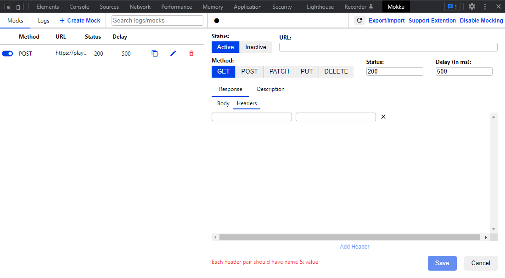

# Mokku (1.7.0)
[Chrome web store](https://chrome.google.com/webstore/detail/mokku-mock-api-calls-seam/llflfcikklhgamfmnjkgpdadpmdplmji) | [GitHub](https://github.com/mukuljainx/Mokku)

## Установка
1. Открыть страницу приложения в [Chrome web store](https://chrome.google.com/webstore/detail/mokku-mock-api-calls-seam/llflfcikklhgamfmnjkgpdadpmdplmji);
2. Нажать кнопку "Add to Chrome";
3. В диалоговом окне подтверждения установки нажать кнопку "Add extension".

## Настройка
Приложение не требует каких-либо настроек после установки.

Рекомендуется разрешить использование в режиме Incognito:
* открыть контекстное меню иконки приложения и выбрать пункт "Manage extension"  

* выставить переключатель "Allow in Incognito" в состояние "Включено"  

## Страницы, на которых нельзя использовать приложение
* about:blank
* chrome://*

## Другие ограничения
* Доступна сборка только под Chrome;
* Требует ручного включения на страницах вне localhost;
* В приложении используется Manifest V2 (будет работать до января 2023).

## Работа с приложением:
1. Открыть тестируемую страницу;
2. Открыть Developer Tools;
3. Перейти на вкладку "Mokku" и нажать кнопку "Enable" (страница будет перезагружена);  

4. [Создать Mock-объект вручную](#create_mock_manually) или [создать mock-объект из сохранённых запросов](#create_mock_from_logs);
5. Повторить действие на странице, по которому уходит запрос к API, для которого был создан мок.

## Интерфейс приложения

### Меню

1. Перейти к вкладке с созданными mock-объектами
2. Перейти к вкладке с сохранёнными запросами
3. [Открыть форму создания mock-объекта](#create_mock_manually)
4. Поиск по созданными мокам и сохранённым запросам
5. Кнопка "Запись": автоматически создавать mock-объекты на все перехваченные запросы, пока продолжается запись
6. Обновить список моков
7. Перейти к форме экспорта и импорта моков
8. Перейти к вкладке с информацией по поддержке разработчика
9. Кнопка выключения приложения на странице

### Вкладка Mocks

1. Статус mock-объекта (вкл/выкл)
2. HTTP метод запроса
3. URL запроса
4. Статус ответа
5. Задержка перед подменой ответа в мс
6. [Дублировать мок (открыть форму создания мока)](#create_mock_manually)
7. [Редактировать мок (открыть форму создания мока)](#create_mock_manually)
8. Удалить мок

###  Вкладка Logs

1. Источник запроса
2. HTTP метод запроса
3. URL запроса
4. Статус ответа
5. Создать мок ("Mock") или перейти к редактированию мока ("Edit")

### [Кнопка Create Mock](#create_mock_manually)

### Поиск

1. Источник запроса
2. HTTP метод запроса
3. URL запроса
4. Статус ответа
5. Создать мок ("Mock") или перейти к редактированию мока ("Edit")

Примечание: поиск осуществляется по URL.

### Вкладка Export/Import

1. Кнопка "Export Mocks" для выгрузки сохранённых моков (JSON файл)
2. Системная кнопка выбора файла для импорта

Примечание: после успешного импорта не происходит автоматического перехода на вкладку Mocks.

##  Создание mock-объекта

### Status
* Active - включить
* Inactive - выключить

### URL
URL запроса.

### Method
Выбор метода запроса. Поддерживаются:
* GET
* POST
* PATCH
* PUT
* DELETE

[Статья на MDN про HTTP методы](https://developer.mozilla.org/en-US/docs/Web/HTTP/Methods)

### Status
Статус ответа.

[Статья на MDN про статусы ответа](https://developer.mozilla.org/en-US/docs/Web/HTTP/Status)

### Delay (in ms)
Время задержки перед отправкой ответа в мс.

### Вкладка Response
Содержит две вкладки: Body и Headers.

#### Body
Отредактировать или написать с тело ответа.

#### Headers
Отредактировать или добавить заголовки, которые будут переданы в ответе.

### Вкладка Description
Описание данного мока.

### Кнопки Save и Cancel
* Save - сохранить мок
* Cancel - закрыть форму без сохранения

## Аналоги

### tweak
[Chrome web store](https://chrome.google.com/webstore/detail/tweak-mock-api-calls/feahianecghpnipmhphmfgmpdodhcapi) | GitHub: -

Примечание: бесплатное, но разрешено сохранить всего двенадцать mock-объектов, а также разработчик планирует перевести приложение на подписочную модель (5$ / месяц).

### Oh-my-Mock
[Chrome web store](https://chrome.google.com/webstore/detail/oh-my-mock/egadlcooejllkdejejkhibmaphidmock) | [GitHub](https://github.com/scaljeri/oh-my-mock)

Примечание: Manifest V2 (будет работать до января 2023).

# IMHO
При подготовке этой заметки я ознакомился с Mokku, tweak и Oh-my-Mock, но в списке установленных расширений оставил именно Mokku.

Почему?

Mokku обладает не самым красивым, но интуитивно понятным интерфейсом, предоставляет все основные функции для работы с запросами, позволяет в пару кликов экспортировать и импортировать моки. Распространяется по лицензии MIT, не имеет встроенных ограничений функциональности.

Что хотелось бы улучшить?

Исправить некоторые баги. Например, опечатка в "Extention" в меню :) или вставка текста в Response > Body, которая не переписывает выделенный текст, а добавляет после.

Больше "резины" в форме создания/редактирования, т.к. сейчас требуется держать определённую минимальную ширину и высоту DevTools, чтобы всё было в поле зрения (горизонтального скролла нет), что не очень удобно при сетапе с одним монитором.
